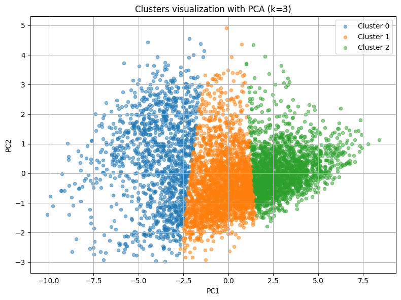
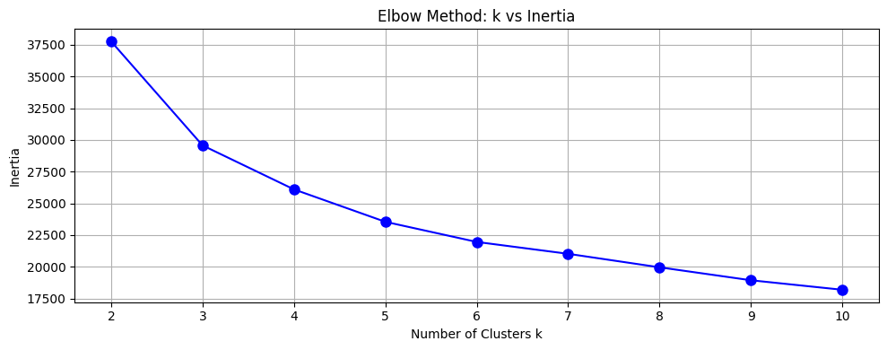
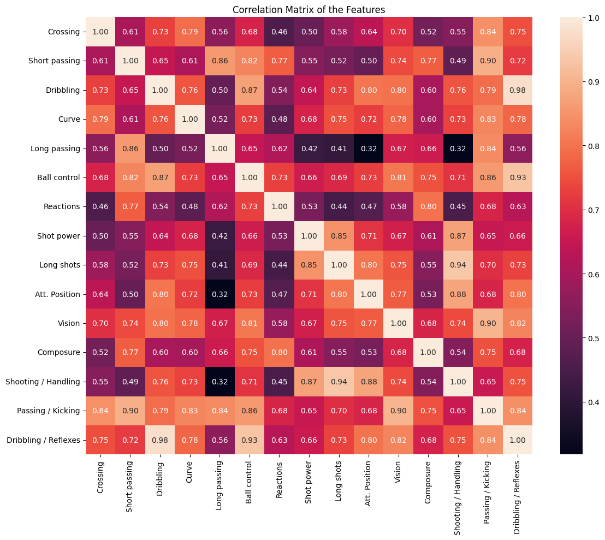

# FC25 Player Scouting with Clustering

## 🏟️ What is this project?

This project uses **FC25 player skill data** to **group players into similar playing profiles** using data science techniques, with the goal of facilitating **scouting and player performance analysis** in an automated fashion.

In simple terms:

* A large dataset of player data (passing skills, shooting, ball control, etc.) is analyzed.
**Clustering** is used to identify **player types**.
* This allows coaches, analysts or fans to understand which players have similar playing styles.

---

## 🛠️ Technologies used

* **Python** (pandas, scikit-learn, matplotlib, seaborn)
* **Machine Learning (KMeans clustering, PCA)**
* **Jupyter Notebooks** for step-by-step analysis.

---

## 📈 How does it work?

1. **Data collection:** FC25 player skills scraped from Sofifa.
2. **Preprocessing:**

   * Data cleaning.
   * Outliers removal.
   * Standardization of skills.
3. **Clustering:** * Application of KMeans to identify groups of players with similar characteristics.

   * Application of KMeans to identify groups of players with similar characteristics.
   * Visualization with PCA to observe the separation of groups.
4. **Analysis of results:** * Interpretation of clusters to identify styles.

   * Interpretation of the clusters to identify players' styles.

---
## 📊 Key visualizations of the project.

### Distribution of Clusters with PCA

.

*2D visualization of the clusters generated after applying PCA, showing the separation between player profiles according to their skills.

---

### 2. Elbow and Silhouette Score




*These plots show how the optimal number of clusters (`k=3`) was determined, balancing the inertia (Elbow Method) and Silhouette score to ensure meaningful groupings.

---

### ♨️ 3. Correlation heat map



*Heatmap showing the correlation between players' technical skills, helping to decide which variables to keep or eliminate before clustering.

---

## 📊 About the data.

The data **is not included in this repository** to maintain scraping privacy.

**However, you can easily get the data by running the scraping script included in:**.

```
📁 scripts/scrapping.py
````

This script allows you to **scrape in an automated way Sofifa** following this flow:

1️⃣ Run the script:

````bash
python scripts/scrapping.py
````

2️⃣ The script will open the browser and load Sofifa, allowing you to:

* Manually select the **variables you want to scrape** (skills, stats, etc.) from the Sofifa page.
* Close the list of selections once you are done.

3️⃣ Go back to the console and type:

````
and
````

to confirm and **run the page-by-page scraping automatically**.

The raw data will be stored in `/data/raw/` locally on your machine for use in the analysis and clustering notebooks.
You can execute the scrapping many times as you need to increase the number of players because trending players of Sofifa not static; duplicated data will be dropped in pre processing stage

---

## 📂 Repository structure.

```
📁 data/
 👉 raw/ # Structure for raw data (empty in the repo)
 👉 processed/ # Structure for processed data (empty in the repo)

📁 notebooks/ # Jupyter Notebooks with step-by-step analysis
📁 scripts/ # Sofifa scraping script
📄 README.md # This file
````

✅ Folders `data/raw` and `data/processed` exist to keep the structure organized, but **do not contain data in this public repository**.
---


## 🚀 How to use.

1️⃣ Clone the repository:

```bash
git clone https://github.com/humbertohp-aidev/fc25-player-scouting.git
cd fc25-player-scouting
````

2️⃣ Install the dependencies:

````bash
pip install -r requirements.txt
````

3️⃣ Run the scraping script to get the data.

4️⃣ Run the notebooks in ``notebooks/` to explore the analysis and clustering.

---

## 💡 Future ideas.

* Increase the dataset size.
* Interactive visualizations with Plotly or Streamlit.

---

## 🤝 Contributions

Contributions to improve visualizations, optimize scraping or add new soccer analysis ideas are welcome via pull requests.

---

## 📧 Contact

📩 [Linkedin](https://www.linkedin.com/in/humbertohp-aidev/)

---

**Thank you for your interest in this project! We hope you find it useful to learn about data science applied to soccer and explore automated player scouting. ⚽📊**
